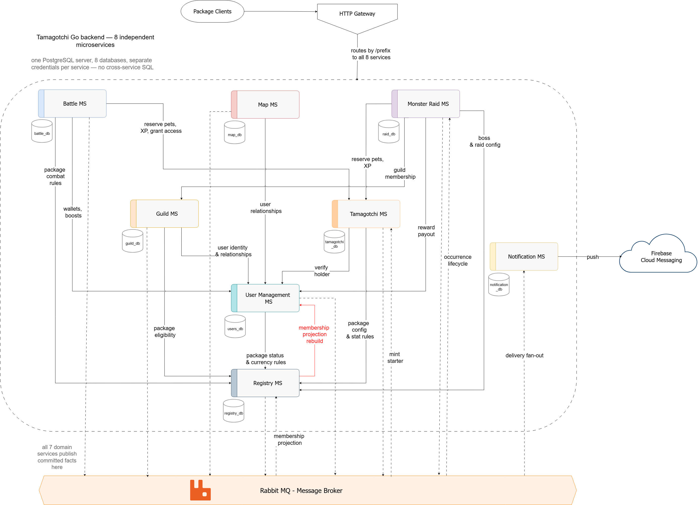

# Tamagotchi Go

Shared backend for virtual pet apps. Different frontend packages ship their own
creatures, art and care rules, backed by eight domain services and a Python Gateway.


## Team

| Member | Services | Language |
|---|---|---|
| Patricia | User Management, Battle | C#, ASP.NET Core |
| Victoria | Tamagotchi, Notification | TypeScript, Node.js |
| Mihaela | Guild, Package Registry | TypeScript, Node.js |
| Sergiu | Map, Monster Raid | C#, ASP.NET Core |
| All four | Gateway | Python, FastAPI |


## Repository

Each service has its own private repository. They are linked here as submodules.

| Service | Submodule path | Owner |
|---|---|---|
| User Management | `services/user-management` | Patricia |
| Battle | `services/battle` | Patricia |
| Tamagotchi | `services/tamagotchi` | Victoria |
| Notification | `services/notifications` | Victoria |
| Guild | `services/guild` | Mihaela |
| Package Registry | `services/package-registry` | Mihaela |
| Map | `services/map` | Sergiu |
| Monster Raid | `services/monster-raid` | Sergiu |
| Gateway | `services/gateway` | Shared by the team |

## Service boundaries

Each service owns one part of the game and one database. Nothing reads another
service's tables.

| Service | Owns | Does not own |
|---|---|---|
| User Management | Accounts, login, JWT issuing, friends, enemies, global and local currency, which packages a user joined | Anything about creatures or battles |
| Tamagotchi | Creatures, origin owner, holder set, primary and secondary role, combat type, level, XP, raw package stats | Damage, battle outcome, what the stats mean |
| Battle | Challenges, turns, damage, who won, XP split, access grant decision | Creature state, currency balances |
| Guild | Guilds, members, roles, invitations, chat | User identity, raid state |
| Package Registry | Packages, stat definitions, bonus rules, starter config, assets, bosses, raid schedule | User data, live raids |
| Map | Latest locations, freshness, who is nearby | Friend lists, battles |
| Monster Raid | Live raids, boss HP, attacks, damage per player, rewards | Boss definitions, guild membership |
| Notification | Devices, push tokens, delivery, history, mute settings | Every domain decision, message text |
| Gateway | REST routing, caller validation, correlation and negotiation | Game rules, domain data, databases, events |

Two rules keep the boundaries honest. Battle decides, Tamagotchi applies.
Package Registry holds configuration, the runtime services hold state.

A third rule follows from the shared-access model described below: a creature is
never moved, only shared. No service transfers ownership, and no service deletes
a creature as the result of a battle.

## Shared access

Winning a battle does not take the loser's creature away. It adds the winner to
that creature's **holder set**. There is still exactly one creature row, with one
level, one XP total and one set of package stats, and every holder sees the same
values. Nothing is split, because nothing is copied.

| Concept | Rule |
|---|---|
| `origin_owner_id` | The user the creature was minted for. Immutable, never changes for any reason |
| `holder_user_ids` | Everyone who may use, care for and select the creature. Contains the origin owner from the moment it is minted |
| Holder cap | **5.** A win against a creature that already has five holders grants global currency instead of access |
| Spread | Access is granted only to the winner of a battle the creature was staked in. It is never revoked, and holders cannot grant it to anyone else |
| Dropping access | A holder may remove themselves. The origin owner may not, so a creature always has at least one holder |
| Care | Any holder may run care actions. There is one hunger value and everyone shares the consequences |
| Primary selection | Per user, and it may point at any creature the user holds. The same creature may be the primary of several users at once |

The cap is what keeps a win meaningful. Without it every creature drifts toward
being held by everyone and the stake disappears; five is high enough that sharing
still spreads and low enough that a strong creature stays worth fighting for.

Shared care is deliberately unguarded. A co-holder can let a shared creature go
hungry, and that is part of the mechanic rather than an oversight.

**One battle at a time.** A creature is exclusive while it fights: it can be in
at most one battle or raid, and a second attempt to field it is refused with
`409 creature_engaged`. Because a creature can now have five holders, three rules
stop that lock from becoming a way to grief the others:

- The lock is taken at `accept`, not when the challenge is created, so an unanswered challenge never blocks anyone.
- A challenge expires after 2 minutes unaccepted, and an accepted battle auto-forfeits after its turn timer runs out, so a disconnected player cannot hold a shared creature forever.
- A user may hold at most one pending challenge per creature, so one holder cannot queue several and occupy it by rotation.

**No last-creature case.** Because a battle never removes a creature from anyone,
a collection cannot be emptied by losing. The only way to end up with nothing is
to drop access to everything, which the origin owner cannot do for their own
creature. The rejoin path and its 24 hour cooldown existed only to repair a
collection emptied by loss, and both are gone.

## Architecture

This section describes the target architecture. Gateway source implements
routing and authorization; Map and Monster Raid integration source uses real
HTTP adapters and durable broker delivery. Published image versions may predate
these changes. Validate the selected image set against real dependencies before
claiming deployment compatibility. The existing diagram still needs its routing
and obsolete dependency paths reconciled with this contract.



Every client goes through the HTTP Gateway. It routes by path prefix to the eight
services, so a frontend package never learns where a service lives or how many
replicas answer.

The dashed box holds the services themselves. Each one owns a single database on
a shared PostgreSQL server, with its own user and grants, so there is no
cross-service SQL. When a service needs something it does not own, it asks the
owner over HTTP: Battle reserves pets, writes XP and grants access through
Tamagotchi, Monster
Raid checks guild membership with Guild, Map resolves relationships through User
Management, and everyone reads combat rules, stat definitions and starter config
from Package Registry. Those calls are synchronous because the caller cannot
continue without the answer.

Everything that already happened goes on the bus instead. All seven domain
services publish committed facts to RabbitMQ, and the consumers decide what
matters to them. Notification is the largest one: it turns those facts into
delivery fan-out and pushes to phones through Firebase Cloud Messaging, without
any publisher knowing it exists. Registry also keeps a membership projection
from User Management events, so package eligibility checks stay local.

Registry builds that projection from the events alone and never reads from User
Management, so no route lists every user's memberships. User Management only
answers `GET /v1/internal/users/{userId}/membership` for one user at a time.

## Technologies

| Service | Stack | Database | Why |
|---|---|---|---|
| User Management | C#, ASP.NET Core | PostgreSQL | Money and identity need strict typing and real transactions |
| Battle | C#, ASP.NET Core | PostgreSQL | Turn state and settlement retries, same reason |
| Tamagotchi | TypeScript, Node.js, Express, Zod | PostgreSQL | Mostly reads and writes rows; JSONB stores package stats with no fixed shape |
| Notification | TypeScript, Node.js, Express, Firebase Admin | PostgreSQL | Waits on the network, never computes |
| Guild | TypeScript, Node.js, Express, WebSocket | PostgreSQL | Chat needs many open connections |
| Package Registry | TypeScript, Node.js, Express| PostgreSQL | Config documents differ per package |
| Map | C#, ASP.NET Core, EF Core | PostgreSQL with PostGIS | Distance queries need a spatial index |
| Monster Raid | C#, ASP.NET Core, EF Core | PostgreSQL | Counters under concurrent attacks |
| Gateway | Python 3.13, FastAPI, Uvicorn, HTTPX, uv | None | Asynchronous REST dispatch without domain state |

The domain services use TypeScript and C#. Gateway uses Python with uv 0.12.23
and a checked dependency lock. It has no database or event publisher.

Trade-offs we accepted:

- Node is slower at CPU work. None of these four services do CPU work.
- C# is more code for a small CRUD endpoint. It pays off where a wrong number is a bug a player can see.
- One PostgreSQL engine everywhere, so one thing to learn and one Compose service. PostGIS is an extension, not a second database.

## Communication patterns

How services talk:

| Interaction | Shape | Technology | Where |
|---|---|---|---|
| Request and response | One to one, synchronous, the caller waits | HTTP, JSON | Client to gateway, and service to service when the answer is needed now |
| Publish and subscribe | One to many, asynchronous | RabbitMQ topic exchanges | Announcing something that already happened |
| Bidirectional stream | One to one, asynchronous, both sides send | WebSocket | Guild chat |
| One way notification | One to one, asynchronous, through a third party | Firebase Cloud Messaging | Push to a phone that is not running the app |

A battle cannot start without the participants, so that call is synchronous. A
granted access is a fact, not a request, so it is an event and the publisher does
not need to know who reacts.

Named patterns we use:

| Pattern | Where |
|---|---|
| API Gateway | One entry point, routes by service prefix, handles auth and correlation IDs |
| Database per Service | Eight databases, separate credentials |
| Transactional Outbox | Every publisher, so a state change and its event commit together |
| Idempotent Consumer | Every consumer, dedupe on `event_id` |
| Dead Letter Channel | Three attempts, then the message parks for the owner to replay |
| Competing Consumers | Replicas of one service share its work queue |
| Correlation Identifier | One ID follows a battle through HTTP, the broker and the push |
| Optimistic Offline Lock | `ETag` and `If-Match` on edits |


## Data management

One database per service. Separate credentials, so a service cannot read another
service's tables even by accident. In development all eight run as separate
schemas in one PostgreSQL container, each with its own user and grants.

What it costs, and what we do instead:

| Cost | Answer |
|---|---|
| No joins across services | Two calls and a join in the caller |
| No foreign keys across services | Events clean up, for example a deleted user |
| No distributed transactions | Outbox at the publisher, dedupe at the consumer |

Consistency is ACID inside a service and eventual between services. Three
mechanisms carry it:

- **Outbox.** A state change and its event commit in one transaction. A poller publishes the row after commit, so nothing is announced for work that rolled back.
- **Idempotency-Key.** Required on every command that is not naturally repeatable. A retry after a timeout does not double an award.
- **Consumer dedupe.** Every consumer stores `event_id` under a unique constraint, so at-least-once delivery becomes one effect.

## Communication contract

The endpoint tables are the agreed target, not runtime verification. New Gateway
specifications below are proposals awaiting affected-owner review. Routing and
negotiation need Mihaela's review; downstream identity and limits need their
owners' agreement before implementation.

### Conventions

| Concern | Rule |
|---|---|
| Gateway routing | `/{service}/v1/...`, the prefix is stripped before the service sees it |
| Payload | JSON, UTF-8, snake_case |
| IDs | UUID v7, string encoded |
| Timestamps | ISO 8601, UTC, milliseconds |
| Errors | RFC 9457, `application/problem+json` |
| Pagination | Opaque cursor, never an offset |
| Concurrency | `ETag` on reads, `If-Match` on writes, 412 on mismatch |
| Idempotency | `Idempotency-Key` header on non-repeatable commands |
| Auth, user | JWT from User Management, verified against a cached JWKS |
| Auth, service | Internal JWT with a `scope` claim, never given to clients |
| Correlation | `X-Correlation-Id` from the gateway, passed on and copied into events |

The tables below name the request and response shape of every endpoint. Each
shape is listed field by field, with types and which fields are required, in
[field-types.md](docs/field-types.md).

Every service also exposes `GET /health` and `GET /ready`, returning 200 or 503.

### Gateway routing and negotiation proposal

Browser/local clients use `http://localhost:3000`; containers use
`http://gateway:3000`. These are local deployment addresses, not production URLs.

| Prefix | Service | Container upstream |
|---|---|---|
| `/users` | User Management | `http://user-management:3001` |
| `/tamagotchi` | Tamagotchi | `http://tamagotchi:3000` |
| `/battle` | Battle | `http://battle:3003` |
| `/guild` | Guild | `http://guild:3000` |
| `/registry` | Package Registry | `http://registry:3000` |
| `/map` | Map | `http://map:8080` |
| `/raid` | Monster Raid | `http://monster-raid:8080` |
| `/notification` | Notification | `http://notification:3000` |

Client and service REST calls traverse Gateway. Strip the prefix exactly once;
preserve method, path/query, body, upstream status and end-to-end headers,
including replay, conditional-request and correlation headers. Remove hop-by-hop
headers and the caller's Authorization before dispatch. For example,
`GET /map/v1/location/{userId}` reaches Map as `GET /v1/location/{userId}`.
Unknown prefixes return `404 unknown_route`; connection/protocol failures return
`502 upstream_unavailable`. Valid upstream error responses remain unchanged.

Direct health/readiness probes, Gateway's configured bootstrap JWKS lookup,
database/broker connections, provider assets and negotiated Guild sockets are
explicit exceptions. Gateway is not an arbitrary external proxy.

| Method and path | Request | Response | Access |
|---|---|---|---|
| `ANY /{service}/v1/...` | downstream request | downstream response | per endpoint |
| `POST /gateway/v1/ws-negotiate` | WsNegotiateInput | 200 WsTicket | user |
| `GET /health` | none | 200 Health | public |
| `GET /ready` | none | 200 Readiness or 503 Problem | public |

Only `guild.chat` is supported by this proposal. Gateway forwards negotiation
to Guild; the exact internal negotiation endpoint must be agreed with Mihaela
before implementation. Guild issues and validates a single-use 30-second ticket.
The browser connects directly to Guild, using a configured browser-reachable
URL, not container DNS. Gateway does not hold the socket open.

| Status | Negotiation code | Condition |
|---|---|---|
| 400 | `invalid_ws_resource` | resource is not guild.chat |
| 400 | `invalid_resource_id` | resource_id is not UUIDv7 |
| 401 | `unauthenticated` | missing or invalid caller token |
| 403 | `guild_membership_required` | caller is not an eligible guild member |
| 404 | `guild_not_found` | guild does not exist |


### Verified identity proposal

The Gateway implements this behaviour. User Management must issue the tokens and
services must verify the assertion before the identity is relied on.

Gateway verifies each bearer token in Authorization, then removes the header before
dispatch. It removes `X-User-Id`, `X-User-Roles`, `X-Service-Name` and any client copy
of `X-Gateway-Assertion`, then sends its own `X-Gateway-Assertion`.
Downstream services use the verified claims in `X-Gateway-Assertion` for identity;
plain headers alone grant no access. Existing endpoint Access columns remain
authoritative. Anonymous assertions carry no user or service permissions.

| Token | Issuer | Audience | Subject | Lifetime |
|---|---|---|---|---|
| User access | tamagotchi-go-users | tamagotchi-go | UUIDv7 user id | 900 seconds |
| Service access | tamagotchi-go-users | canonical destination service | service:name | 300 seconds |
| Gateway assertion | tamagotchi-go-gateway | canonical destination service | verified caller or anonymous | at most 30 seconds |

Access tokens use `typ=at+jwt`; assertions use `typ=gateway-assertion+jwt`.

Roles come from User Management. It reads them from its table when it issues a
user access token at login, as a `roles` claim: an array of 0 to 20 strings of 1 to
64 characters, `[]` for an ordinary user. Gateway checks that shape and copies the
verified roles into the assertion. Service access tokens carry `scope` only and no
roles, so service assertions have empty roles. `admin` is the only role in use.
Allow only RS256 with RSA keys of at least 2048 bits. Verify signature, type,
issuer, audience, subject, issuance and expiry; never choose algorithms or key
URLs from untrusted claims. Allow five seconds of token clock tolerance, but
none for request deadlines. See [JWT validation guidance](https://www.rfc-editor.org/rfc/rfc8725.html).
JWT time claims use NumericDate seconds; the signed request deadline uses Unix
milliseconds. Application timestamps remain ISO 8601 UTC with milliseconds.

Gateway alone holds its assertion private key. Services load the public JWKS
from a mounted file. Use `GATEWAY_ASSERTION_PRIVATE_KEY_PATH`,
`GATEWAY_ASSERTION_KEY_ID` and `GATEWAY_ASSERTION_JWKS_PATH` for configuration;
services and Gateway load the public set. Gateway uses it to verify nested
service context and to check key readiness.
Paths and key ids are configuration, never private key values in documentation.
Deploy a new public key first, switch Gateway's signing kid, then remove the old
key after its assertions and five-second tolerance expire. Keep access-token
and assertion key sets separate.

Gateway fetches User Management keys asynchronously from the configured direct
`GET /v1/jwks` bootstrap URL, with a 300-second cache. An unknown kid triggers
one refresh shared by concurrent requests. Valid cached keys remain usable
within the cache lifetime; never accept unknown keys or an expired cache because
refresh failed. Invalid tokens return `401 unauthenticated`. Refresh failure
without a usable key returns `503 auth_keys_unavailable`.

**Service tokens.** A service that calls another service asks User Management for a
token with `POST /v1/service-tokens`, body `{service_name, audience, scopes}`. The token
has `sub=service:<service_name>`, `aud` the one destination service, a `scope` claim
that is a single space-separated string, and lasts 300 seconds. It carries no roles.
Clients keep one token per destination and scope set, and renew it about 30 seconds
before it expires.

The route is public at the Gateway, because a service has no token before its first one.
The caller proves who it is in one of two ways, and a wrong credential never falls back
to the other:

- Its own client secret, in the header `X-Service-Secret`. The Gateway forwards that
  header unchanged and does not treat it as a bearer token. Each service that calls another
  service holds its own secret as `SERVICE_CLIENT_SECRET` and never sends it anywhere else.
  User Management verifies it against the secret configured for `service_name`. Registry
  and Notification call no other service and have none.
- An admin user, with no secret.

The issuer checks a configured allowlist of destinations and scopes for that service.
Requesting a scope does not grant it: if any scope asked for is not on the allowlist,
nothing is issued. The caller is authenticated before the allowlist is consulted. Gateway
checks the service token audience against the routed destination; downstream services
enforce the required permissions from the signed assertion.

| Status | Code | Condition |
|---|---|---|
| 400 | `validation_error` | unknown `service_name` or `audience`, more than 20 scopes, or a scope that is empty, over 64 characters or contains whitespace |
| 401 | `invalid_client` | wrong, missing or repeated secret, or a service with no secret. One answer for all of them, so none can be told apart from outside |
| 403 | `admin_required` | no secret, and the caller is a user who is not an admin or is another service |
| 403 | `audience_not_allowed` | the service may not call that destination |
| 403 | `scope_not_allowed` | at least one scope asked for is not allowed, and the detail names only those |
| 503 | `signing_key_unavailable` | User Management has no usable signing key |

A scope is `<prefix>:<action>` in lower case, where the prefix is the Gateway prefix of the
service being called: `users`, `tamagotchi`, `battle`, `guild`, `registry`, `map`, `raid`
or `notification`. Each owner names the scopes on their own service. User Management's are:

| Scope | Route |
|---|---|
| `users:read-profile` | `GET /v1/users/{userId}`, user or service |
| `users:read-relationships` | `GET /v1/users/{userId}/relationships`, user or service |
| `users:check-relationship` | `GET /v1/users/{userId}/relationship/{otherId}` |
| `users:read-wallet` | `GET /v1/users/{userId}/currency/global`, user or service |
| `users:credit-global` | `POST /v1/users/{userId}/currency/global/add` |
| `users:credit-local` | `POST /v1/users/{userId}/currency/local/add` |
| `users:settle-battle` | `POST /v1/internal/battle-settlements` |
| `users:consume-boost` | `POST /v1/internal/boost-consumptions` |
| `users:read-membership` | `GET /v1/internal/users/{userId}/membership` |

Tamagotchi's are:

| Scope | Route | Caller |
|---|---|---|
| `tamagotchi:read-creature` | `GET /v1/tamagotchis/{id}`, user or service | |
| `tamagotchi:award-xp` | `POST /v1/tamagotchis/{id}/xp` | Battle and Monster Raid, at settlement |
| `tamagotchi:grant-access` | `POST /v1/tamagotchis/{id}/holders` | Battle, at settlement |
| `tamagotchi:read-holders` | `GET /v1/tamagotchis/{id}/holders`, user or service | |
| `tamagotchi:read-collection` | `GET /v1/users/{userId}/collection`, user or service | Monster Raid |
| `tamagotchi:reserve-engagement` | `POST /v1/internal/engagements` | Battle, Monster Raid |
| `tamagotchi:read-engagement` | `GET /v1/internal/engagements/{referenceId}` | Battle, Monster Raid |
| `tamagotchi:release-engagement` | `POST /v1/internal/engagements/{referenceId}/release` | Battle, Monster Raid |
| `tamagotchi:mint` | `POST /v1/tamagotchis` | none yet |

`tamagotchi:mint` is named for completeness. A creature is minted from
`user.package_joined.v1`, which Tamagotchi consumes itself, so no service calls
that route today and nothing should be allowlisted for it until one does.

Notification has no scopes. All eight of its routes are user access, it publishes
nothing and no service calls it, which is also why it holds no
`SERVICE_CLIENT_SECRET`.

Guild's is:

| Scope | Route | Caller |
|---|---|---|
| `guild:read` | `GET /v1/guilds/{guildId}` and `GET /v1/guilds/{guildId}/members`, both user or service | Monster Raid |

Monster Raid calls both Guild routes through Gateway for leader and membership
checks. Its `guild:read` grant belongs to caller `monster-raid`.

Registry's are:

| Scope | Route | Caller |
|---|---|---|
| `registry:read-config` | `GET /v1/packages/{packageId}/stat-definitions`, `stat-bonuses`, `currency-rules` and `starter-pet` | Tamagotchi for package configuration; User Management for currency rules; Monster Raid for stat bonuses |
| `registry:check-eligibility` | `POST /v1/packages/eligibility-check` | Guild |
| `registry:read-bosses` | `GET /v1/bosses/{bossId}`, user or service | Monster Raid |
| `registry:read-occurrences` | `GET /v1/raid-occurrences/{id}`, user or service | Monster Raid |
| `registry:read-members` | `GET /v1/packages/{packageId}/users` | none yet |

`registry:read-members` is named for completeness; no service calls it today,
so nothing should be allowlisted for it until one does.

Registry calls no other service, so it holds no `SERVICE_CLIENT_SECRET` either.

Map and Monster Raid request these issuer allowlist entries. Each row is a
caller service, a single destination audience and its permitted scope set:

| `service_name` | `audience` | Scopes |
|---|---|---|
| `map` | `user-management` | `users:read-relationships` |
| `monster-raid` | `user-management` | `users:credit-global` |
| `monster-raid` | `guild` | `guild:read` |
| `monster-raid` | `package-registry` | `registry:read-config`, `registry:read-bosses`, `registry:read-occurrences` |
| `monster-raid` | `tamagotchi` | `tamagotchi:read-collection`, `tamagotchi:reserve-engagement`, `tamagotchi:read-engagement`, `tamagotchi:release-engagement`, `tamagotchi:award-xp` |

Raid requests one operation scope per token; the table describes the allowed
set, not a combined token for all destinations. The older proposal names
`tamagotchi:engage` and `tamagotchi:grant-xp` are superseded. `raid:read` protects
service reads of a raid and its leaderboard, but has no current service caller;
do not add a speculative issuer grant. These caller requirements do not establish
that the User Management policy or deployed images already implement them.

A user needs no scope on the routes marked user or service. A service without the scope
gets `403 insufficient_scope`. Which service may have which scope is the User Management
allowlist, `service-token-policy.json`, and each owner adds their own lines to it by pull request.

Public routes are exactly those marked public in the endpoint tables, plus
Gateway health/readiness. If Authorization is supplied even on a public route,
validate it; an invalid token does not become an anonymous request. The direct
User Management JWKS bootstrap and service health/readiness probes are explicit
exceptions to downstream assertion enforcement. Other direct domain calls must
fail without a valid Gateway assertion.

| Downstream status | Code | Condition |
|---|---|---|
| 401 | `invalid_gateway_assertion` | missing, repeated, forged, expired, wrong-type or wrong-audience assertion, or invalid claims |
| 401 | `unauthorized` | valid assertion, but anonymous on a route that needs a caller |
| 403 | `insufficient_scope` | valid assertion lacks required permissions, including the wrong kind of caller (a service on a user route, a user on a service route) |
| 403 | `not_self` | a user asked for another user's resource on a route limited to its owner |
| 503 | `gateway_keys_unavailable` | the service cannot read the Gateway's public keys, so it cannot verify any assertion |

Every route except `GET /health`, `GET /ready` and the User Management `GET /v1/jwks`
needs an assertion, public routes included, which carry an anonymous one.

Gateway removes `X-User-Id`, `X-User-Roles` and `X-Service-Name` from every request.
Services take identity only from the verified assertion.
Never log bearer tokens, assertions, key material or refresh credentials.

### Work limits proposal

This remains the specification for affected-owner review. Gateway, Map and
Monster Raid integration source enforces admission, deadlines and cancellation.
The values below are initial policy defaults, not measured throughput. Other
service implementations and the selected deployed images need their own
acceptance evidence.

| Component | Local timeout | Per-process admission |
|---|---|---|
| Gateway | 5000 ms | 64 client/public requests and 64 authenticated service requests |
| Each domain service | 3000 ms | 64 tasks shared by domain requests, message processing and worker batches |

Only a verified service access token enters Gateway's service pool. A caller
cannot select it with headers. There is no admission waiting queue: a full pool
returns `503 too_many_tasks` with `Retry-After: 1`. An expired deadline returns
`504 task_timeout`. Even the reserved service pool may saturate; calls fail promptly rather than
waiting while holding another slot. Gateway performs
no automatic retries of HTTP mutations.

A new Gateway root gets deadline `now + 5000 ms`, carried in the assertion as
`deadline_unix_ms`. Each service's effective deadline is the earlier of the root
deadline and `now + 3000 ms`. Convert the remaining budget to a local monotonic
timer; never restart a full timeout for each dependency or attempt.

Request aborts, deadlines and shutdown cancel HTTP/SQL operations. Roll back
uncommitted work and retain any committed receipt/effect progress. Release a
slot only when its actual work and cleanup finish, not merely when the client
has received a timeout. No detached work may escape the capacity accounting.

Health/readiness probes use a separate bounded three-second check and no domain
slot. Startup initialization remains governed by shutdown cancellation.
Established Guild sockets do not occupy Gateway HTTP slots; negotiation and
message handling are bounded tasks. Guild owns its separate socket lifetime and
connection policy. A worker batch uses a service slot and local deadline; leave
durable work pending and retry on its normal schedule if no slot is available.

Required evidence: rejection under saturation, inherited deadline budgets,
deadline/abort/shutdown cancellation, rollback, worker recovery and slot reuse.
HTTP failure does not prove that an external side effect did not commit; command
replay and durable reward effects handle uncertain outcomes.

<a id="command-replay-and-pagination-proposal"></a>

### Command replay and pagination

Map/Raid integration branches implement command replay and cursors. The pinned
published images predate this work. Affected-owner compatibility review and real
deployment validation remain required; successful response shapes stay unchanged.

Replay covers `POST /map/v1/location`, `POST /raid/v1/raids` and
`POST /raid/v1/raids/{raidId}/attack`, and the nine User Management commands
named under its implementation notes. Require an Idempotency-Key of 1 to 128
printable ASCII characters after HTTP header whitespace normalization; absence
or invalid values return `400 invalid_idempotency_key`. Keys are case-sensitive.
Scope is the verified caller, HTTP operation and resource path. Fingerprint the
validated request model with deterministic field order, normalized UUIDs and
UTC timestamps; JSON property order alone must not create a conflict.

Retain completed receipts for 24 hours from completion. Identical retries return
the stored status/body and applicable response headers, with the current request's
correlation header. Do not replay transport, authentication or correlation
headers from the old request. Changed input returns `409 idempotency_conflict`;
concurrent pending work returns `409 command_in_progress`.
Authenticate/authorize before lookup, including every replay. Malformed input
and authentication failures do not reserve a key. Persist successful and final
domain-error receipts with their local state transition. Do not freeze transient
dependency, capacity or timeout errors as completed receipts. Durable pending
work must recover uncertain external effects before completing the receipt.
Persist local effects and receipts atomically; reward/reservation effect keys
and progress remain independent of receipt expiry. Receipt expiry does not
permit awarding the same completed raid twice.

Pagination uses versioned HMAC-signed opaque cursors with five-minute expiry,
bound to verified caller, endpoint, filters and page size. Store signing keys
in service-owned configuration, never in a cursor or committed file. Reject
tampering, unsupported versions, expiry and context mismatch with
`400 invalid_cursor`; limit defaults to 100 and must be 1 to 100. Keep limit and
filters unchanged while following a cursor. Continue strictly after its last
sort tuple and return next_cursor=null when no further results remain.

| Endpoint | Sort tuple | Context invalidation |
|---|---|---|
| Map nearby | distance_m ascending, user_id ascending | changed viewer observation returns 409 cursor_stale |
| Raid list | started_at descending, raid_id descending | caller/filter mismatch returns 400 invalid_cursor |
| Raid leaderboard | damage_dealt descending, joined_at ascending, user_id ascending | changed raid_version returns 409 cursor_stale |
| User Management friend requests | expires_at descending, request_id descending | caller or page size mismatch returns 400 invalid_cursor |
| User Management relationships | other_user_id ascending | caller, listed user or page size mismatch returns 400 invalid_cursor |
| User Management boosts | boost_id ascending | caller or page size mismatch returns 400 invalid_cursor |

Bind Map's cursor to the full viewer observation, including coordinates, since
equal-timestamp location changes remain valid. Freshness and current visibility
are checked on every page; a missing/expired viewer still returns
`409 viewer_location_unavailable`. Filters include guild_id or raidId where
applicable. These are live queries, not stored result snapshots: movement and
relationship changes can move a nearby player across a page boundary, causing
omissions or repeats between pages. Clients replace markers by user_id rather
than accumulating duplicates. A stale-context response requires restarting
pagination. Raid list creation/deletion can likewise change the live result set.

### Example shapes

```json
// Tamagotchi
{
  "id": "0192f3c4-77a1-7b28-b0c4-1f2a5e9d3c07",
  "name": "Ember",
  "origin_package_id": "0192f3c1-8a44-7c31-9e02-6b1d4f8a2c11",
  "origin_owner_id": "0192f3c2-1b09-7f5a-8d33-2e7c9a04b6df",
  "holder_user_ids": [
    "0192f3c2-1b09-7f5a-8d33-2e7c9a04b6df",
    "0192f3c8-5d12-7a44-9c81-3b6e0f2a91c5"
  ],
  "role": "PRIMARY",
  "combat_type": "FLAME",
  "level": 12,
  "xp": 240,
  "sprite_ref": "pkg.dragons/ember/idle_v3",
  "package_stats": { "hunger": 85, "happiness": 60, "tiredness": 30 },
  "acquired_at": "2026-09-07T18:42:11.031Z",
  "version": 2
}
```

```json
// Error, any service
{
  "type": "https://tamagotchi.go/problems/primary-already-exists",
  "title": "The user already holds a primary Tamagotchi",
  "status": 409,
  "detail": "User 0192f3c2 holds primary 0192f3c4.",
  "instance": "/v1/tamagotchis",
  "correlation_id": "0192f3d0-4c67-7a19-9b55-8e3f1a7c2d40"
}
```

```json
// Event envelope, any publisher
{
  "event_id": "0192f3d5-9e02-7c88-b134-7a6f2e5d8c31",
  "event_type": "tamagotchi.access_granted.v1",
  "occurred_at": "2026-09-07T19:03:52.884Z",
  "producer": "tamagotchi-service",
  "correlation_id": "0192f3d0-4c67-7a19-9b55-8e3f1a7c2d40",
  "data": { }
}
```

### User Management, `/users`

| Method and path | Request | Response | Access |
|---|---|---|---|
| `POST /v1/users/register` | Register, Idempotency-Key | 201 Registration | public |
| `POST /v1/users/login` | Login | 200 Tokens | public |
| `POST /v1/auth/refresh` | Refresh | 200 Tokens | public |
| `POST /v1/auth/logout` | Refresh | 204 | public |
| `POST /v1/service-tokens` | ServiceTokenRequest, X-Service-Secret | 200 ServiceToken | service client secret or admin |
| `GET /v1/jwks` | none | 200 Jwks | public |
| `GET /v1/users/me` | none | 200 User | user |
| `GET /v1/users/{userId}` | none | 200 UserProfile | user or service |
| `POST /v1/users/me/packages` | JoinPackage, Idempotency-Key | 200 User | user |
| `GET /v1/internal/users/{userId}/membership` | none | 200 MembershipSnapshot | service |
| `GET /v1/users/{userId}/relationships` | query limit, cursor | 200 RelationshipPage | user or service |
| `GET /v1/users/{userId}/relationship/{otherId}` | none | 200 Relationship | service |
| `POST /v1/friend-requests` | FriendRequestInput, Idempotency-Key | 201 FriendRequest | user |
| `GET /v1/friend-requests` | query limit, cursor | 200 FriendRequestPage | user |
| `POST /v1/friend-requests/{id}/accept` | Idempotency-Key | 200 FriendRequest | user |
| `POST /v1/friend-requests/{id}/reject` | Idempotency-Key | 200 FriendRequest | user |
| `DELETE /v1/users/{userId}/friends/{otherId}` | none | 204 | user |
| `PUT /v1/users/{userId}/enemies/{otherId}` | none | 200 Relationship | user |
| `DELETE /v1/users/{userId}/enemies/{otherId}` | none | 204 | user |
| `GET /v1/users/{userId}/currency/global` | none | 200 Wallet | user or service |
| `GET /v1/users/{userId}/currency/local/{packageId}` | none | 200 Wallet | user |
| `POST /v1/users/{userId}/currency/global/add` | Credit, Idempotency-Key | 200 CreditReceipt | service |
| `POST /v1/users/{userId}/currency/local/add` | LocalCredit, Idempotency-Key | 200 CreditReceipt | service |
| `POST /v1/internal/battle-settlements` | BattleSettlementInput, Idempotency-Key | 200 BattleSettlement | service |
| `GET /v1/users/me/boosts` | query limit, cursor | 200 BoostPage | user |
| `POST /v1/internal/boost-consumptions` | ConsumeBoost, Idempotency-Key | 200 BoostReceipt | service |

**Implementation notes.** Decisions the authentication routes needed that the tables
above did not spell out, as implemented by User Management:

- Error codes added beyond the shared `Problem` shape: `invalid_credentials` (login, 401,
  the same answer for an unknown email and a wrong password), `package_membership_required`
  (login, 403, the password is right but the user has not joined `package_id`),
  `invalid_refresh_token` (refresh, 401, unknown, revoked, expired or reused),
  `signing_key_unavailable` (login, refresh and `GET /v1/jwks`, 503, no usable
  access-token key).
- Nothing about the package goes into the access token. Membership of `package_id` is
  checked at login only.
- Refresh tokens are opaque, stored hashed, rotate on every use and last 30 days. A token
  that was already used is refused, except for a 10 second grace window from its first use,
  so a client that lost the response can retry once. The window does not slide.
- `POST /v1/auth/logout` revokes the refresh token it is given. It answers 204 for any
  well-formed body, known token or not, so it reveals nothing and is safe to repeat.
- `GET /v1/jwks` sends `Cache-Control: public, max-age=300`, matching the Gateway's cache.
  Token responses send `Cache-Control: no-store`.
- Key rotation: publish the new public key in the JWKS first, then switch the signing
  `kid`, then remove the old key once its tokens have expired.
- Callers are identified only by the verified Gateway assertion. The answers for a missing
  or wrong caller are in the downstream failure table of the verified identity proposal.

**Command replay.** The nine commands above marked `Idempotency-Key` (register, join a package,
create, accept and reject a friend request, both currency credits, battle settlement and boost
consumption) follow the replay rules of the proposal under "Command replay and pagination
proposal": a key of 1 to 128 printable ASCII characters, scope of verified caller, HTTP operation
and resource path, and receipts kept 24 hours. The anonymous caller of register is scoped by the
route alone. Beyond those rules, as implemented by User Management:

- A request without a valid key is `400 invalid_idempotency_key`, before anything else is done.
  Authentication and scope are checked first, on every replay.
- The same key with a changed request is `409 idempotency_conflict`.
- A retry that arrives while the first request is still running waits for it and then gets the
  same answer. If the first has not finished after 5 seconds the retry is
  `409 command_in_progress`.
- A successful result and a final domain error (for example `409 already_joined` or
  `422 unknown_package`) are stored and replayed. A failure that may pass, such as
  `502 upstream_unavailable`, `503` or `504`, is not stored, so the retry runs again.
- The effect and its receipt are saved together or not at all. A stored response never
  contains a password or a token.

**Pagination.** The three lists above that take `limit` and `cursor` (friend requests, relationships and
boosts) follow the cursor rules of the proposal under "Command replay and pagination proposal", with the
sort tuples in its table. There is no membership list any more, so there is no fourth. As implemented by
User Management:

- `limit` defaults to 100. A value below 1 or above 100, or one that is not a whole number, is
  `400 validation_error`, not a silently clamped page.
- The sort tuple is unique for relationships (`other_user_id`) and boosts (`boost_id`), because each is
  unique for the listed user. Friend requests break ties between equal `expires_at` by `request_id`, so
  no request is skipped or repeated.
- A cursor is bound to the verified caller, the endpoint, the listed user (relationships) and the page
  size. A different caller, endpoint, listed user or `limit` is `400 invalid_cursor`, as are a tampered,
  malformed, expired or unsupported-version cursor. Every page returns a new cursor, valid for five
  minutes from the moment it was issued.
- The lists are live queries, not snapshots. A row added or removed between two pages is seen or not
  according to where it sorts relative to the cursor: one that sorts before the last tuple is not shown
  and one that sorts after it is. `next_cursor` is `null` on the last page, including when the last page
  is exactly full.
- The signing key is service configuration (`CURSOR_SIGNING_KEY`), never part of a cursor or committed.

Joining a package grants that package's starter once per user per package, and
that is the only path by which a creature is minted for a player. There is no
rejoin path, no starter regrant and no cooldown: since a battle never empties a
collection, none of that has anything left to repair.

`POST /v1/internal/battle-settlements` moves global currency only. The creature
side of a battle is settled by Battle calling Tamagotchi, and this service is
never told which creature was staked.

A win against a creature that has already reached the holder cap is compensated
here instead, as a global currency credit with reason `BATTLE_ACCESS_CAP`.

### Tamagotchi, `/tamagotchi`

| Method and path | Request | Response | Access |
|---|---|---|---|
| `POST /v1/tamagotchis` | Mint, Idempotency-Key | 201 Tamagotchi | service |
| `GET /v1/tamagotchis/{id}` | none | 200 Tamagotchi | user or service |
| `GET /v1/tamagotchis` | query holder_id, package_id, type, limit, cursor | 200 TamagotchiPage | user |
| `POST /v1/tamagotchis/{id}/care` | CareInput, Idempotency-Key | 200 CareReceipt | user |
| `POST /v1/tamagotchis/{id}/xp` | XpInput, Idempotency-Key | 200 XpReceipt | service |
| `POST /v1/tamagotchis/{id}/holders` | GrantAccessInput, Idempotency-Key | 200 AccessGrantReceipt | service |
| `GET /v1/tamagotchis/{id}/holders` | none | 200 Holders | user or service |
| `DELETE /v1/tamagotchis/{id}/holders/{userId}` | If-Match | 204 | user |
| `GET /v1/users/{userId}/collection` | query limit, cursor | 200 Collection | user or service |
| `GET /v1/users/{userId}/collection/primary` | none | 200 PrimarySelection | user |
| `PUT /v1/users/{userId}/collection/primary` | PrimaryInput, If-Match | 200 PrimarySelection | user |
| `DELETE /v1/users/{userId}/collection/{id}` | If-Match | 204 | user |
| `GET /v1/types` | none | 200 TypeList | public |
| `GET /v1/types/matrix` | none | 200 TypeMatrix | public |
| `POST /v1/internal/engagements` | EngagementInput, Idempotency-Key | 201 Engagement | service |
| `GET /v1/internal/engagements/{referenceId}` | none | 200 Engagement | service |
| `POST /v1/internal/engagements/{referenceId}/release` | Idempotency-Key | 200 Engagement | service |

`package_stats` is stored as it arrives and returned as stored. This service
never reads inside it. Package Registry owns what the fields mean.

`POST /holders` is the only way the holder set grows, it is called by Battle at
settlement, and it is idempotent in three directions: a repeat with the same
`Idempotency-Key` returns the first receipt, a grant to someone who already holds
the creature returns `ALREADY_HOLDER` and changes nothing, and a grant to a
creature at the cap of five returns `CAP_REACHED` and changes nothing. Battle
reads that outcome and credits currency instead when the cap was reached.

`DELETE /holders/{userId}` lets a holder drop a creature they no longer want. A
user may only remove themselves, and the request is refused with `409` when the
caller is the creature's `origin_owner_id`, so every creature keeps at least one
holder and no creature is ever orphaned.

`role` in a `Tamagotchi` response is relative to the user the request is made
for, because primary is a per-user selection. The same creature comes back as
`PRIMARY` for one holder and `SECONDARY` for another, and `GET /collection`
splits it accordingly.

Level is global. One XP table lives here, and a package decides how much XP its
care actions award, never what a level is worth. `sprite_ref` is a logical id,
resolved by the client through Package Registry's public asset manifest, so a
creature shared across packages still renders.

**Engagements.** `POST /internal/engagements` is the exclusive lock described in
[Shared access](#shared-access). Battle calls it when a challenge is accepted,
not when it is created, and it reserves all four creatures of both lineups at
once. If any of them is already engaged the whole call is refused with
`409 creature_engaged` and nothing is reserved, so a battle never starts
half-locked. An engagement carries an `expires_at`; once it passes, the lock is
released by the owner even if Battle never called `/release`, so a crashed battle
cannot strand a shared creature.

Monster Raid takes the same lock for a primary contributed to a raid, which is
why a creature cannot be in a raid and a battle at the same time. A raid sends
one engagement per admitted participant, each with its own `reference_id`
(a fresh UUIDv7 that Raid stores against the raid and the user), so that
`reference_id` stays unique and reserve and release can be retried independently.
Lookup and release use that `reference_id`, which is the `{referenceId}` path
parameter. A raid-wide `reference_id` is not allowed, since a second participant
would collide with the first.

### Battle, `/battle`

| Method and path | Request | Response | Access |
|---|---|---|---|
| `POST /v1/battles` | BattleInput, Idempotency-Key | 201 Battle | user |
| `GET /v1/battles` | query limit, cursor | 200 BattlePage | user |
| `GET /v1/battles/{battleId}` | none | 200 Battle | user |
| `POST /v1/battles/{battleId}/accept` | BattleAccept, Idempotency-Key | 202 Battle | user |
| `POST /v1/battles/{battleId}/reject` | Idempotency-Key | 200 Battle | user |
| `POST /v1/battles/{battleId}/attack` | ActorInput, Idempotency-Key | 200 BattleAttack | user |
| `POST /v1/battles/{battleId}/forfeit` | Idempotency-Key | 200 Battle | user |

**What is at stake.** Each side names its `primary_id` and `secondary_id` when
challenging or accepting, and the primary is the creature at stake. Both are
validated against the caller's holder set, so a player may field any creature
they hold, including one they won from someone else. A creature is not refused
for being shared with the opponent already, but a grant to a user who is already
a holder is a no-op, so nothing is gained by fighting for one twice.

**Settlement is three calls and one event.** Battle credits the winner and debits
the loser through User Management, writes the XP split through Tamagotchi at
60/40 between primary and secondary, and calls `POST /tamagotchis/{id}/holders`
to add the winner to the loser's primary. If that grant comes back `CAP_REACHED`,
Battle credits the winner global currency with reason `BATTLE_ACCESS_CAP`
instead. `settlement_status` and `access_grant_status` on the battle track the
two halves separately, since either can be retried alone.

**Timers.** A challenge expires 2 minutes after creation if it is not accepted,
and an accepted battle whose turn timer runs out is auto-forfeited. Both exist to
release the engagement lock, and both are enforced here rather than in Tamagotchi
because Battle owns the turn state.

### Guild, `/guild`

| Method and path | Request | Response | Access |
|---|---|---|---|
| `POST /v1/guilds` | GuildInput, Idempotency-Key | 201 Guild | user |
| `GET /v1/guilds` | query limit, cursor | 200 GuildPage | user |
| `GET /v1/guilds/{guildId}` | none | 200 Guild | user or service |
| `GET /v1/guilds/{guildId}/members` | none | 200 Members | user or service |
| `POST /v1/guilds/{guildId}/invitations` | InvitationInput, Idempotency-Key | 201 Invitation | user |
| `GET /v1/invitations` | query limit, cursor | 200 InvitationPage | user |
| `POST /v1/guilds/{guildId}/invitations/{id}/accept` | Idempotency-Key | 200 Invitation | user |
| `POST /v1/guilds/{guildId}/invitations/{id}/decline` | Idempotency-Key | 200 Invitation | user |
| `POST /v1/guilds/{guildId}/invitations/{id}/revoke` | Idempotency-Key | 200 Invitation | user |
| `DELETE /v1/guilds/{guildId}/members/{userId}` | none | 204 | user |
| `PATCH /v1/guilds/{guildId}/members/{userId}/role` | RoleInput, Idempotency-Key | 200 Members | user |
| `POST /v1/guilds/{guildId}/leadership` | LeaderInput, Idempotency-Key | 200 Guild | user |
| `DELETE /v1/guilds/{guildId}` | none | 204 | user |
| `GET /v1/guilds/{guildId}/messages` | query limit, cursor | 200 ChatPage | user |
| `POST /v1/guilds/{guildId}/chat-tickets` | none | 201 ChatTicket | user |
| `GET /v1/guilds/{guildId}/chat` | WebSocket upgrade | 101 | ticket in the first frame |

A chat ticket is issued to a current member for one connection. It is valid for 30
seconds and can be used once. Membership is checked when the ticket is issued and
again when it is used. The browser never sends a token in the URL or the handshake:
it opens the socket without credentials and sends `{"type":"auth","ticket":"..."}`
as its first frame within 5 seconds. A bad ticket closes with 4401 (`invalid_ticket`),
a member who has left closes with 4403. The `Ws` shapes in
[field-types.md](docs/field-types.md) are the frames sent over the socket.

The Gateway's `ws-negotiate` (`POST /gateway/v1/ws-negotiate`) is the entry point
for browsers: it verifies the caller, asks Guild for a ticket, and returns the
browser URL with the ticket.

Guild calls User Management for user identity and relationships, and Package
Registry only for package eligibility. The topic text points at Registry Service
for identity checks, which is a wording error: User Management is the authority
on who a user is and who they are friends with.

**Implementation notes.** A few decisions the code needed that the
contract above did not spell out:

- A user belongs to at most one guild at a time.
- An invitation expires 7 days after it is created.
- `PATCH .../role` locks on `expected_guild_version` in the body rather than an
  `If-Match` header, since the general ETag/If-Match convention is written for a
  single resource version, not a role change nested under a member. A stale
  value answers `409 version_conflict`.
- Guild calls the already-contracted `GET /v1/internal/users/{userId}/membership`
  to read a user's `package_ids` before calling Package Registry's eligibility
  check; no contract change was needed for this. Until User Management and
  Package Registry exist for real, both are stood in for with a mock behind
  the same interface the real HTTP client uses, so swapping in the real
  services later is a configuration change, not a code change.
- Error codes added beyond the shared `Problem` shape: `already_in_guild`,
  `guild_name_taken`, `guild_full`, `invitation_pending`, `invitation_expired`,
  `invitation_not_pending`, `not_invitee`, `insufficient_role`,
  `leader_cannot_leave`, `leader_role_fixed`, `already_leader`,
  `version_conflict`, `relationship_blocked`, `package_not_eligible`,
  `dependency_unavailable`, `dependency_error`.

### Package Registry, `/registry`

| Method and path | Request | Response | Access |
|---|---|---|---|
| `POST /v1/packages` | PackageInput, Idempotency-Key | 201 Package | admin |
| `GET /v1/packages` | query limit, cursor | 200 PackagePage | public |
| `GET /v1/packages/{packageId}` | none | 200 Package | public |
| `PATCH /v1/packages/{packageId}` | PackageEdit, If-Match | 200 Package | moderator |
| `PUT /v1/packages/{packageId}/stats` | PackageConfigWrite, Idempotency-Key | 200 PackageConfig | moderator |
| `GET /v1/packages/{packageId}/stat-definitions` | query config_version | 200 StatDefinitions | service |
| `GET /v1/packages/{packageId}/stat-bonuses` | query config_version | 200 Bonuses | service |
| `GET /v1/packages/{packageId}/currency-rules` | query config_version | 200 CurrencyRules | service |
| `GET /v1/packages/{packageId}/starter-pet` | query config_version | 200 StarterConfig | service |
| `GET /v1/packages/{packageId}/assets` | query config_version | 200 Assets | public |
| `GET /v1/packages/{packageId}/users` | query limit, cursor | 200 PackageMemberPage | service |
| `POST /v1/packages/eligibility-check` | EligibilityInput | 200 Eligibility | service |
| `POST /v1/bosses` | BossInput, Idempotency-Key | 201 Boss | admin |
| `GET /v1/bosses` | query limit, cursor | 200 BossPage | admin |
| `GET /v1/bosses/{bossId}` | query config_version | 200 Boss | user or service |
| `PUT /v1/bosses/{bossId}` | BossInput, If-Match | 200 Boss | admin |
| `POST /v1/raid-occurrences` | OccurrenceInput, Idempotency-Key | 201 Occurrence | admin |
| `GET /v1/raid-occurrences` | query limit, cursor | 200 OccurrencePage | user |
| `GET /v1/raid-occurrences/{id}` | none | 200 Occurrence | user or service |
| `POST /v1/raid-occurrences/{id}/activate` | Idempotency-Key | 200 OccurrenceReceipt | admin |
| `POST /v1/raid-occurrences/{id}/deactivate` | Idempotency-Key | 200 OccurrenceReceipt | admin |
| `POST /v1/raid-occurrences/{id}/cancel` | Idempotency-Key | 200 OccurrenceReceipt | admin |

Packages are abstract to this backend. A package defines its own creatures, art
and care rules in its own frontend, and nothing here knows what `hunger` or
`discipline` is supposed to mean. What Registry stores is a *declaration*: a
`StatDefinition` gives a key a type and bounds so a value can be validated, and a
`BonusRule` is a generic comparison with a stat key, operator, threshold, effect,
value in basis points. Battle evaluates those rules mechanically against the
creature's `package_stats` without interpreting any of them, which is how a
package-specific bonus applies without any service sharing the package's data
model.

**Implementation notes.** Decisions the code needed beyond the contract:

- Package `name` is not required to be unique; nothing in the contract asks for
  it, unlike a guild's name which doubles as its public identity.
- `revision` and `config_version` are two separate counters on the same
  `Package` row: `revision` is the optimistic-lock counter shared by
  `PATCH /packages/{id}` (`If-Match` header) and `PUT /packages/{id}/stats`
  (`expected_package_revision` in the body); `config_version` only tracks which
  `package_configs` snapshot is current, and is what the `?config_version=`
  query parameter on the read endpoints selects among.
- `POST /packages/eligibility-check` treats a submitted package as eligible if
  it exists and its `status` is `active`; the caller is eligible overall if at
  least one submitted package qualifies.
- Admins are identified by a fixed, configured list (`ADMIN_USER_IDS`) rather
  than a real claim, until User Management can issue one. A package's
  moderators are read directly from that package's own `moderator_user_ids`,
  which needed no mock since it is the service's own data.
- Error codes added beyond the shared `Problem` shape: `admin_required`,
  `moderator_required`, `if_match_required`, `precondition_failed`,
  `revision_conflict`, `config_not_found`, `invalid_boss_version`,
  `invalid_window`, `invalid_transition`, `package_not_found`,
  `boss_not_found`, `occurrence_not_found`.

### Map, `/map`

| Method and path | Request | Response | Access |
|---|---|---|---|
| `POST /v1/location` | LocationInput, Idempotency-Key | 200 LocationReceipt | user |
| `GET /v1/location/{userId}` | none | 200 Location | user |
| `GET /v1/location/nearby/{userId}` | query limit, cursor | 200 Nearby | user |
| `DELETE /v1/location/{userId}` | none | 204 | user |

Friends and enemies are visible while their location is fresh. Strangers appear
within 6 metres, which is configurable.

Every location write, deletion, raw read and nearby query requires a verified
user matching `user_id` or the path's `userId`. Nearby is the interface for
viewing other players. Plain identity headers grant no access.

Map fetches the complete relationships list through Gateway. If any page fails,
it discards classification and returns only fresh six-metre strangers, with
`partial=true` and `partial_reason=RELATIONSHIPS_UNAVAILABLE`. Reads publish no
events. Accepted observations persist encounter transitions and outbox facts;
an encounter emits once per episode and ends on deletion, expiry or separation.
Unavailable relationship classification produces no proximity event.

The public `GET`/`HEAD /map/demo/` assets display nearby markers with MapLibre
and OpenFreeMap. Their application API calls remain authenticated through
Gateway; provider assets and tiles are the documented external exception.

### Monster Raid, `/raid`

| Method and path | Request | Response | Access |
|---|---|---|---|
| `POST /v1/raids` | RaidInput, Idempotency-Key | 201 Raid | user |
| `GET /v1/raids` | query guild_id, limit, cursor | 200 RaidPage | user |
| `GET /v1/raids/{raidId}` | none | 200 Raid | user or service |
| `POST /v1/raids/{raidId}/attack` | ActorInput, Idempotency-Key | 200 RaidAttack | user |
| `GET /v1/raids/{raidId}/leaderboard` | query limit, cursor | 200 Leaderboard | user or service |
| `DELETE /v1/raids/{raidId}` | none | 204 | user |

Creation and cancellation require the Guild leader. Attacks require membership
and a verified user matching `user_id`. Global listing requires a user; a guild
filter requires membership. User detail/leaderboard reads require membership;
verified service reads require `raid:read`. Plain identity headers grant no access.

Creation requires an active occurrence inside its availability window. Raid
expiry is the earlier of configured duration and `available_until`. Boss
configuration and participant creature/bonus snapshots remain immutable.
Admission persists its engagement reference before reserving through Tamagotchi;
pending admissions count toward capacity. External calls run outside mutation
locks, followed by transactional invariant and one-second cooldown checks.

Damage starts at `10 * level`, applies matching `ATTACK_BPS` bonuses, then
weakness `*1.5` or resistance `*0.75`, and subtracts boss defense. Weakness takes
precedence. Floor the result with minimum one; credit at most remaining boss HP.
No boost consumption is included.

Victory global currency and XP are total reward pools, allocated in proportion
to credited damage. Rounding remainders use fractional remainder descending,
then user UUID ascending. XP targets the contributed creature. Terminal state,
entitlements, engagement cleanup and lifecycle outbox facts commit together;
HTTP effects use stable keys and durable progress outside mutation locks.
Permanent delivery failures become `NEEDS_ATTENTION`.

Expiry fails active raids once. When the pinned boss has non-null defeat rewards,
each admitted participant receives the configured global currency and XP amounts;
XP targets the contributed creature. Pending admissions earn nothing. Null
configuration or no participants produces no payout. Existing raids keep their
original snapshots. Currency credits use RAID_WIN or RAID_DEFEAT; XP uses RAID.
Registry deactivation or
cancellation cancels matching active raids and releases engagements without
rewards. Older occurrence versions are ignored. Existing legacy mocked snapshots
remain readable/cancellable but production attacks return
`409 legacy_snapshot_unavailable`.

### Notification, `/notification`

| Method and path | Request | Response | Access |
|---|---|---|---|
| `POST /v1/devices` | DeviceInput, Idempotency-Key | 200 Device | user |
| `GET /v1/devices` | query limit, cursor | 200 DevicePage | user |
| `DELETE /v1/devices/{id}` | none | 204 | user |
| `GET /v1/users/{userId}/notifications` | query limit, cursor | 200 NotificationPage | user |
| `PATCH /v1/notifications/{id}` | ReadInput | 200 Notification | user |
| `POST /v1/users/{userId}/notifications/read-all` | ReadAllInput, Idempotency-Key | 200 ReadAllReceipt | user |
| `GET /v1/users/{userId}/preferences` | none | 200 Preferences | user |
| `PUT /v1/users/{userId}/preferences` | PreferencesInput, If-Match | 200 Preferences | user |

Push carries a type and parameters, never a finished sentence. Each package
renders and translates its own text, so one wording is not forced on every
frontend.

```json
{
  "token": "fH9k...",
  "data": {
    "type": "TAMAGOTCHI_SHARED",
    "notification_id": "0192f3e4-6b71-7d92-a3c5-8e1f4b2d7a90",
    "params": "{\"tamagotchi_name\":\"Ember\",\"level\":3}"
  },
  "android": { "priority": "high" }
}
```

### Events

Seven durable topic exchanges, one per publisher. Notification publishes
nothing. Each event payload is an `...Event` shape in
[field-types.md](docs/field-types.md).

| Routing key | Publisher | Consumer | Purpose |
|---|---|---|---|
| `user.package_joined.v1` | User Management | Tamagotchi, Package Registry | Grant the package starter if the user has none for it. Update the membership projection |
| `user.friend_request_created.v1` | User Management | Notification | FRIEND_REQUEST, carries `from_username` |
| `tamagotchi.created.v1` | Tamagotchi | audit | A creature was minted |
| `tamagotchi.access_granted.v1` | Tamagotchi | Notification | TAMAGOTCHI_SHARED, sent to every holder the creature already had |
| `tamagotchi.leveled_up.v1` | Tamagotchi | audit | Level threshold crossed |
| `battle.request_created.v1` | Battle | Notification | BATTLE_REQUEST, carries `challenger_username` |
| `battle.completed.v1` | Battle | audit | Battle resolved |
| `guild.invitation_created.v1` | Guild | Notification | GUILD_INVITATION |
| `guild.member_joined.v1` | Guild | audit | Invitation accepted |
| `guild.member_left.v1` | Guild | audit | Kicked or left |
| `registry.occurrence_changed.v1` | Package Registry | Monster Raid | Raid schedule changed |
| `map.proximity_detected.v1` | Map | Notification | PLAYER_NEARBY, both users |
| `raid.started.v1` | Monster Raid | Notification | RAID_STARTED, recipients carried in the event |
| `raid.completed.v1` | Monster Raid | audit | Boss died or the timer ran out |

#### Broker delivery proposal

Pending publisher/consumer-owner review and Mihaela's deployment compatibility.
Sergiu coordinates topology; Mihaela owns shared broker deployment. This change
does not add a running broker or implement publication/consumption.

| Publisher | Durable topic exchange |
|---|---|
| User Management | `user-management.events` |
| Tamagotchi | `tamagotchi.events` |
| Battle | `battle.events` |
| Guild | `guild.events` |
| Package Registry | `package-registry.events` |
| Map | `map.events` |
| Monster Raid | `monster-raid.events` |

Use each event's existing routing key and envelope; no event payload changes.
Bindings follow the Events table above, with exact keys rather than wildcards.

| Consumer | Work queue | Subscriptions |
|---|---|---|
| Tamagotchi | `tamagotchi.work` | user.package_joined.v1 |
| Package Registry | `package-registry.work` | user.package_joined.v1 |
| Monster Raid | `monster-raid.work` | registry.occurrence_changed.v1 |
| Notification | `notification.work` | the six Notification events in the table above |
| Passive audit destination | `audit.work` | all events marked audit above |

Map has no consumer/inbox under this contract. Notification publishes nothing.
The passive audit queue retains events for broker-coordinator inspection; it
does not introduce an audit service or a processing consumer.

Each active consumer has `<consumer>.work`, `<consumer>.retry.5s`,
`<consumer>.retry.30s` and `<consumer>.dlq`. Use durable quorum queues and
persistent messages (`delivery_mode=2`, content type application/json).
Retry queues use queue TTLs of 5000/30000 ms and dead-letter to the default
exchange with routing key `<consumer>.work`. Configure at-least-once
dead-lettering and reject-publish overflow on the retry queues; verify support
in the deployed RabbitMQ version before implementation. No work-queue TTL is
applied.

Producers set `x-attempt=1`. A failed first delivery publishes to the consumer's
five-second retry queue with x-attempt=2; a failed second delivery publishes to
its thirty-second queue with x-attempt=3. A failed third delivery publishes to
its DLQ. Publish retries directly through the default exchange, addressed to
that queue, so other subscribers do not receive the retry. Preserve event_id,
correlation, body and `x-original-routing-key`; never reset the attempt on
redelivery. Owner-driven DLQ replay resets x-attempt=1 and retains event_id.

Commit domain state and an outbox row together. Publish after commit with
publisher confirms and mandatory routing; an unroutable return or missing
confirmation leaves delivery pending. Record outbox delivery only after a
positive confirmation with no return. Consumers persist event_id deduplication
with their effects, then acknowledge. Duplicate deliveries cause no new effect.
For retry/DLQ transfer, confirm the new persistent message before acknowledging
the original. If transfer fails, retain/requeue the original without a busy
retry loop. Crash recovery may redeliver; deduplication must tolerate it.
Publisher confirms do not establish that a consumer processed the message.
See [acknowledgements](https://www.rabbitmq.com/docs/confirms) and
[dead-lettering](https://www.rabbitmq.com/docs/dlx).

Use `RABBITMQ_URL` with service-specific credentials and least-privilege broker
permissions. Keep its value in untracked configuration or secrets; examples
name the variable without credentials. Gateway and database credentials are
separate. Validate outage/recovery, redelivery, poison-message retries/DLQ,
consumer restart and unroutable publication before claiming real delivery.

## Image publication

Release, code, package and image versions use `X.Y.Z`: integration milestone,
release revision and patch.
Start each release line at Z=0. Existing tags and releases remain unchanged.

Each service's workflow must publish after CI passes on a tested merge into
`main`. One build produces the numeric version and `latest` for `linux/amd64`
and `linux/arm64`. Choose an unused version in the service's release metadata;
serialize publication, reject existing numeric tags and stop if registry checks fail.

Repository owners configure `DOCKERHUB_USERNAME` and `DOCKERHUB_TOKEN` as Actions
secrets and approve publication activation. Workflows with a publication gate
remain disabled until that approval.

Shared publishes no image. It pins tested numeric image versions in Compose and
records them in release notes. Only Shared receives an annotated `vX.Y.Z` tag
and GitHub Release on its tested `main` merge. See [CONTRIBUTING.md](CONTRIBUTING.md).

## Deployment

`deploy/compose.yaml` pulls nine versioned images under the `tamagotchi-go`
Compose project. Each service has its own credentials and database in one
PostGIS-enabled PostgreSQL container. A RabbitMQ broker runs alongside it, with
one account per publishing or consuming service (see below).

| Service | Image | Host port |
|---|---|---|
| Gateway | `victoriamutruc/gateway:2.0.2` | 3000 |
| User Management | `patriciamoraru/user-management:2.0.0` | 3001 |
| Tamagotchi | `victoriamutruc/tamagotchi:2.0.1` | 3002 |
| Battle | `patriciamoraru/battle:1.2.0` | 3003 |
| Guild | `mihaelacatan/guild-service:0.2.0` | 3004 |
| Package Registry | `mihaelacatan/package-registry-service:0.2.0` | 3005 |
| Map | `sergedbs/map:1.0.0` | 3006 |
| Monster Raid | `sergedbs/monster-raid:1.0.0` | 3007 |
| Notification | `victoriamutruc/notification:2.0.1` | 3008 |

The pinned Map/Raid images predate their current integration branches. To test
unpublished source, use a local Compose override that builds Map, Monster Raid
and Gateway from their standalone checkouts, with distinct local image names
and `pull_policy: never`. Keep the override outside Git. Replace canonical pins
only after the corresponding numeric images are published and validated.

Requires Docker with Compose v2 and free host ports 3000 through 3008 and
5432. The Gateway starts last, after all eight services report healthy, so a
healthy Gateway only proves its registered checks passed; it does not establish
routing, authentication or continuing downstream availability. PostgreSQL listens on
`127.0.0.1:5432` for local administration. Use
`postgres` as the admin user and database, with `DATABASE_ADMIN_PASSWORD` from
`deploy/.env`.

If `deploy/.env` already exists, keep it. Otherwise, create it before startup:

```bash
cd deploy
test -f .env || cp .env.example .env
# Set every database password, the RabbitMQ passwords and the other values marked in .env.example.
./gateway/generate-keys.sh   # once: creates secrets/ for the Gateway signing keys
./user-management/generate-keys.sh   # once: creates the key User Management signs access tokens with
docker compose --env-file .env up -d --wait
```

Use distinct URL-safe passwords in the untracked `.env`.

### Broker and accounts

`rabbitmq` runs with the management plugin, bound to `127.0.0.1` (AMQP `5672`,
management `15672`). `rabbitmq-provision` runs once after the broker is healthy:
it merges service accounts, all seven exchanges, exact subscription bindings
and quorum work/retry/DLQ queues through `deploy/rabbitmq/provision.py`.
It includes User Management's publisher account and preserves existing broker
data and Guild/Registry account names. Retry queues
use five-/thirty-second message TTLs and an at-least-once dead-letter policy.
The passive audit queue has no processing service.

The provisioning step uses the admin account. Publishers can write only their
exchange; consumers can read their subscribed exchanges/queues and transfer
retries through the default exchange. Set every broker password named in
`deploy/.env.example`; no credentials are committed. Provisioning does not
prove consumer delivery. Runtime validation
against RabbitMQ 4.1 remains required before deployment acceptance.

Gateway signing keys: `deploy/gateway/generate-keys.sh` creates the Gateway's
private signing key and the public key set in `deploy/secrets/`, which Git ignores.
The Gateway mounts both files; Guild, Registry, Map and Monster Raid mount the
public key set. Usable keys are required for authenticated requests. Run the
script once before the first start, and keep the private key on your machine.

User Management keys: `deploy/user-management/generate-keys.sh` creates the
private key it signs access tokens with, `deploy/secrets/access-token.pem`,
which Git ignores and which is never overwritten. Its public key is published at
`GET /users/v1/jwks`. The service also mounts the Gateway's public key set to
verify `X-Gateway-Assertion`. Set `USER_MANAGEMENT_CURSOR_SIGNING_KEY`
(`openssl rand -base64 32`) in `.env`: it signs the page cursors, so every
instance must share it. User Management writes its events to an outbox and
publishes them when the broker is reachable, so it does not wait for the broker
in Compose either.

### Service tokens

A service that calls another service fetches its own token from
`POST /users/v1/service-tokens`, with `X-Service-Secret: <its secret>`. Set
`USER_MANAGEMENT_SERVICE_CLIENT_SECRET`, `TAMAGOTCHI_SERVICE_CLIENT_SECRET`,
`BATTLE_SERVICE_CLIENT_SECRET`, `GUILD_SERVICE_CLIENT_SECRET`,
`MAP_SERVICE_CLIENT_SECRET` and `MONSTER_RAID_SERVICE_CLIENT_SECRET` in `.env`.
Registry and Notification call no other service, so they have no secret.

Caller secrets must match User Management's registered client credentials and
scope policy. Setting a caller variable does not configure the issuer or grant
permission. Preserve existing keys and credentials when updating local settings.

Map and Monster Raid call `http://gateway:3000`. Configure their distinct
base64 cursor keys and broker credentials from `.env.example`; Raid's broker
account is `monster-raid`. Both wait for broker provisioning before startup.
Scope overrides must match the issuer policy; their defaults are requested
grants, not evidence of permission. Existing database volumes are preserved.

On first start, the
database initializer creates eight databases and roles, applies the User
Management and Battle SQL, and enables PostGIS for Map. The remaining services
create their own schema at startup. The shared volume is separate from each
service's standalone volume. Initialization does not rerun on an existing volume.

### Seed data

Run the included seed commands after the stack starts:

```bash
docker compose exec guild node dist/db/seed.js
docker compose exec registry node dist/db/seed.js
docker compose exec tamagotchi node dist/db/seed.js
docker compose exec notification node dist/db/seed.js
docker compose exec user-management dotnet UserManagement.dll seed
docker compose exec battle dotnet Battle.dll seed
```

Map and Monster Raid seed through Gateway using Python 3. From each standalone
repository, run `scripts/seed.sh` after configuring real fixtures in your
untracked environment:

| Service | Required inputs | Default Gateway URL |
|---|---|---|
| Map | `MAP_USER_ID`, `MAP_USER_TOKEN` | `http://localhost:3000/map` |
| Monster Raid | `RAID_GUILD_ID`, `RAID_OCCURRENCE_ID`, `RAID_LEADER_TOKEN` | `http://localhost:3000/raid` |

Tokens must match the location owner or Guild leader. The occurrence must be
active. Override `MAP_BASE_URL` or `MONSTER_RAID_BASE_URL` for another Gateway
address. Existing matching records are preserved; auth/dependency failures stop
seeding. Mutations carry command keys and are not automatically retried.

### API collections

Import the eight collections in `postman/` and select
`postman/tamagotchi-go.postman_environment.json`. The environment defines one
base URL per service, and all of them now point at the Gateway
(`http://localhost:3000/<prefix>`). The Gateway and the services must be running
first. Registry's admin-only requests need a caller whose token carries the
`admin` role; otherwise they are refused. Map requests prepare locations for two
supplied real accounts. Raid requests require a supplied real Guild, leader,
active occurrence and eligible primary creature; they do not create those
external prerequisites.
Run the other service collections in order when a request depends on a previous
response. See [Postman instructions](postman/README.md).

## GitHub workflow

`develop` is the integration and default branch; `main` is the release branch.
Create work branches from `develop` using `feat/`, `fix/`, `docs/`, or `chore/`.
Changes to either shared branch require a pull request, one approval, resolved
conversations, and a passing `ci` check. New commits dismiss prior approvals.
Squash work branches into `develop` and merge releases into `main` with a
merge commit. Contract changes also need review from affected service owners.

Versioning and publication follow [Image publication](#image-publication).

Track work in the [team project](https://github.com/orgs/PAD-TEAM-9-2026/projects/1).
See [CONTRIBUTING.md](CONTRIBUTING.md) for checks, PR content, and releases.

## Service documents

Each private repository README repeats its own endpoints, events and dependencies, so the
service can be read on its own.
